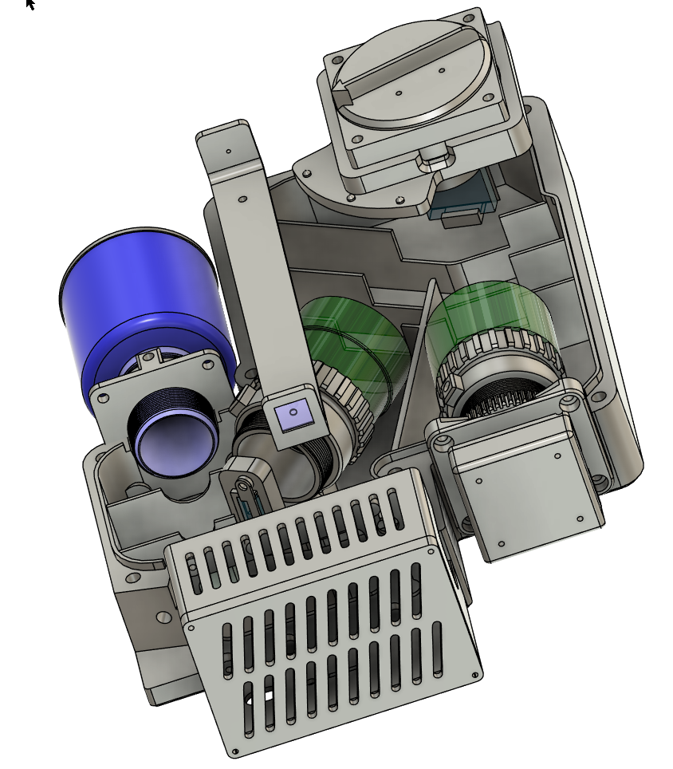
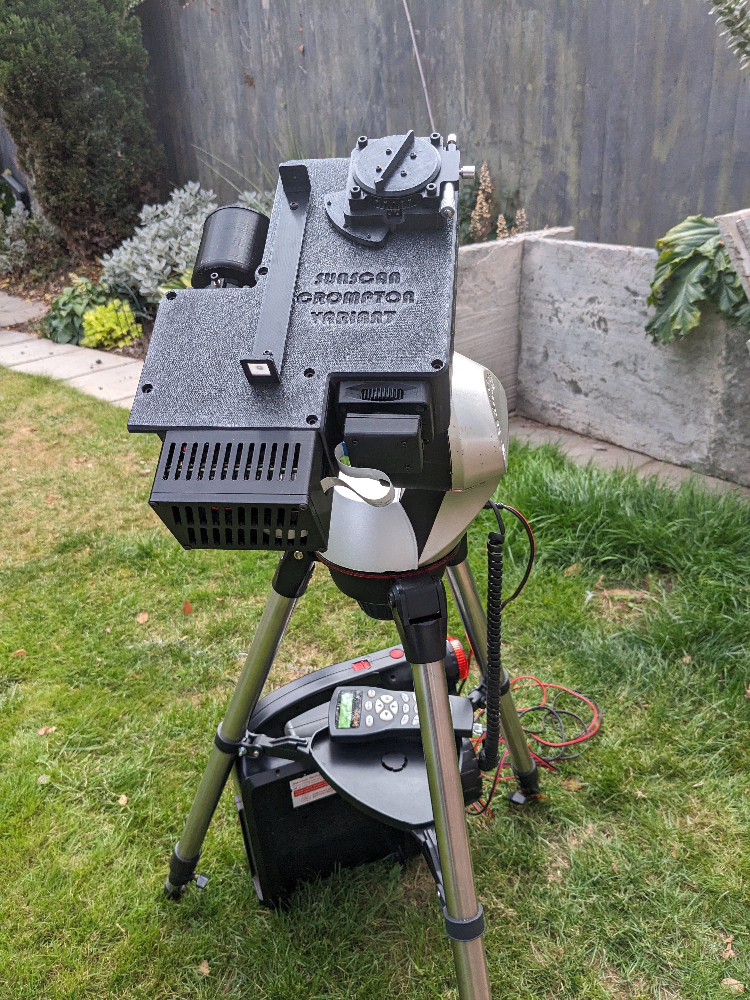
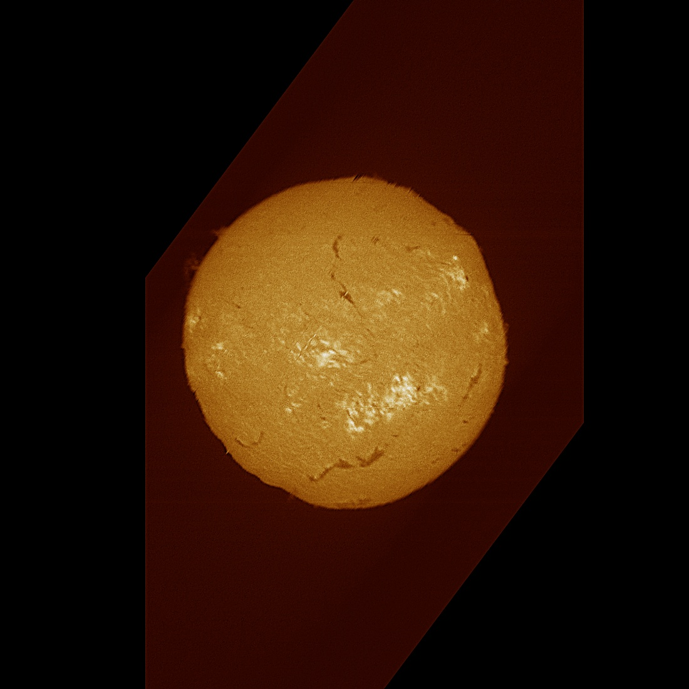
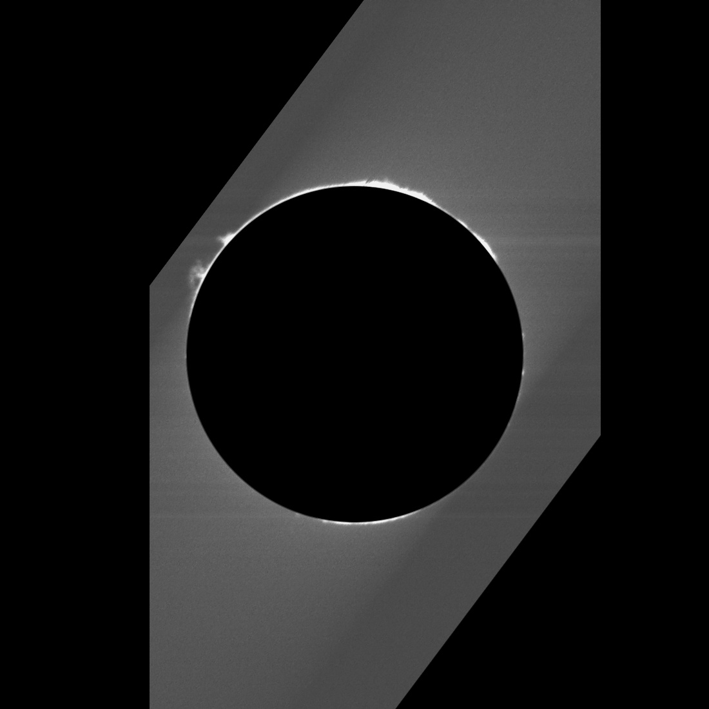
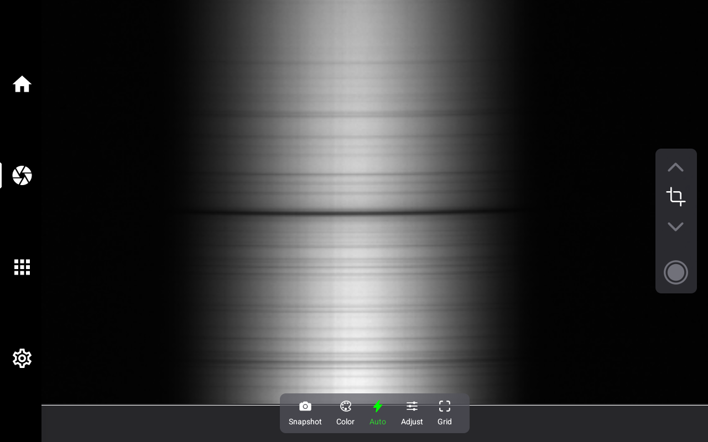
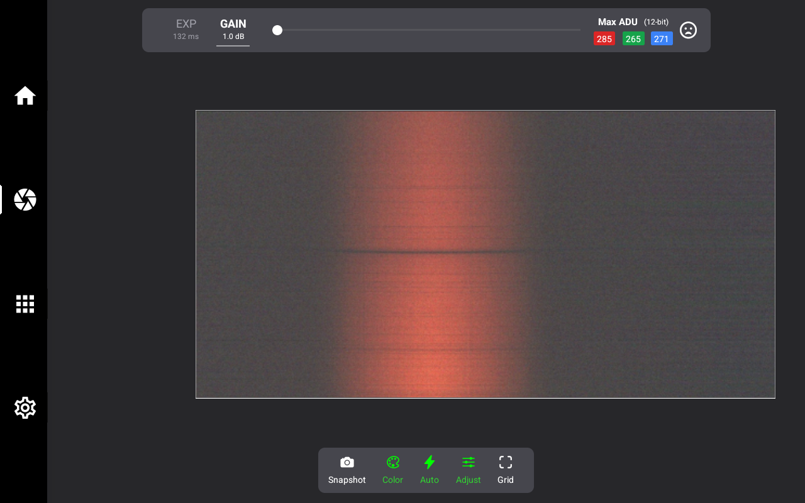

# Sunscan-Crompton-Variant
Inspired by the Staros Project's Sunscan spectro heliograph my version uses second hand M39 75mm enlarger lenses and a stopped down 50mm objective lens from an old Skywatcher 9 x 50 finder scope.

Details of the official Sunscan project can be found [here](https://www.sunscan.net/) and I strongly recommend you read through everything they have on there if you want to understand what I put up here. SUNSCAN © 2024 by Staros Projects.

The primary difference between the official Sunscan and this one are:

- M39 enlarger lenses for the collimator and the camera lenses
- 50mm objective lens from a Skywatcher 9 x 50 finder scope
- Use of an RS60-L Manual Trimming Station Platform Linear Stage Tuning Sliding Table φ60mm (as described on ebay) for the grating holder

I had previously bought the turntable in preparation for an attempt at the PVC spectro heligraph (https://github.com/terawats/PVC_Spectroheliograph) so I decided to incorporate that too. This also necessitated a different approach to how the defraction grating is adjusted. It is now ajusted using a single M3 machine screw accessed through the window behind the grating holder. The actual turntable I bought is this one from ebay https://www.ebay.co.uk/itm/396515045796

The M39 enlarger lenses I picked up off ebay for around £20, I have three to choose from:

- Schneider - Kreuznach 75mm f1:4.0 (used for the collimator)
- Hoya Super EL 75mm f1:4.5 (used for the camera lens)
- Perfex 90mm F4.5 Anastigmat (alternative camera lens near to Sunscan 100mm focal length)

The model is created in the Autodesk Fusion (Personal use) version. Most of the print files are on here, the three that you will still need to get from the original Sunscan 3D prints are the two part mirror holder and the Raspberry Pi power button. A complete list of the components used is in the [Components.md](Components.md) file along with a link to the Sunscan print file page.

Fasteners and inserts are mostly M2, M3 or M4 either cap head socket screws or button head screws. If you follow the [Sunscan assembly instructions](https://www.sunscan.net/build/1.-assembly-instructions/) you will get a good idea of what is needed. Instead of assembling their optical components you will need to screw the enlarger lenses into the M39 focus tubes and assembly the objective lens sub-assembly. There are three videos in the videos folder that show how the collator sub assembly, the objective lens sub assembly and the focuser sub assembly are put together.

I used M2, M3 and M4 heat set inserts for the parts that need to be taken apart and put back together again. The RPi case and camera case use M2 inserts and screws where as on the Sunscan they use self tapping screws.

The electronics are all identical to the original Sunscan project, as is the software I use. You can follow the instructions on the Sunscan site for installing the Raspberry Pi OS and configuring and adjusting the device.

Finally a big thank you to Staros Projects for creating the Sunscan project and making all the information available for free. 

## Images

### The completed Crompton variant looks like this:

### Without the top cover.

### First light mounted on a Skywatcher Synscan AZ mount.

### First images captured on a less than perfect day. Patchy clouds meant that I couldn't quite get the focus right or the exposure.

#### Ha Image

#### Artificial eclipse

]

#### Screen shot showing Ha Line in mono

and in colour

## License

The Sunscan licence page is [here](https://www.sunscan.net/the-sunscan-project/license).

This work is licensed under a [Creative Commons Attribution-NonCommercial-ShareAlike 4.0 International License](https://creativecommons.org/licenses/by-nc-sa/4.0/).

